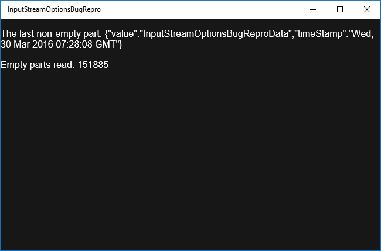

# InputStreamOptionsBugRepro
A bug repro for [`DataReader.loadAsync`](https://msdn.microsoft.com/en-us/library/windows/apps/windows.storage.streams.datareader.loadasync.aspx) with [`InputStreamOptions.partial`](https://msdn.microsoft.com/en-us/library/windows/apps/windows.storage.streams.inputstreamoptions.aspx) set, which responds when zero byte is available while it must not according to their documentation.

Related discussions: [StackOverflow](https://stackoverflow.com/questions/35527614/datareader-loadasync-is-being-completed-even-when-unconsumedbufferlength-is-0), [MSDN](https://social.msdn.microsoft.com/Forums/windowsapps/en-US/a83f27fe-d843-4d93-8b6d-e7b71f62dfb9/datareaderloadasync-is-being-completed-even-when-unconsumedbufferlength-is-0?forum=wpdevelop)

### Environment

* Windows 10
* Node.js (5.x is used but lower versions should work)
* Visual Studio 2015

### Repro process

1. Run the server: `node server/server.js`
2. Deploy the client app on VS2015.
3. The `Empty parts read` count should always be kept as 0. Otherwise, it means `DataReader.loadAsync` is finished even when there is zero bytes available, and in other words, [`InputStreamOptions.partial`](https://msdn.microsoft.com/en-us/library/windows/apps/windows.storage.streams.inputstreamoptions.aspx) is not working as documented.

   > The asynchronous read operation completes when one or more bytes is available.
   
### Screenshot

